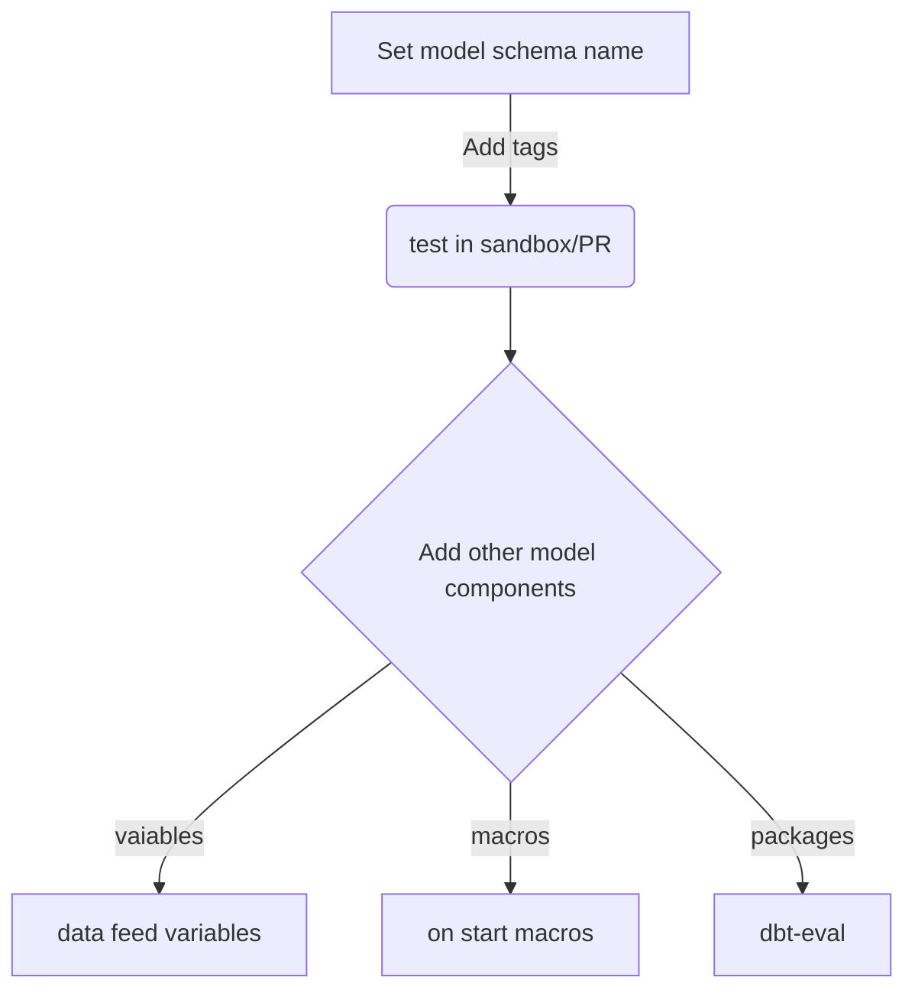

## Introduction

This doc describes the {{SUBJECT}} flow in our system. We will follow its implementation across the various locations so you can understand how the different parts create the full picture.

## Following the flow

&nbsp;

<SwmSnippet path="/dbt_project.yml" line="2">

---

This code snippet is a configuration file for the dbt (data build tool) project. It sets up various paths for models, analyses, tests, seeds, macros, and snapshots. It also specifies the target directory where compiled SQL files will be stored. Additionally, it defines a variable called `truncate_timespan_to` with the value of the current timestamp. Finally, it includes a model called `demo_data` with a sub-model named `marts` that is set to be materialized as a table.

```yaml
name: 'demo_data'

version: '1.0.0'
config-version: 2

# This setting configures which "profile" dbt uses for this project.
profile: 'demo_data'

model-paths: ["models"]
analysis-paths: ["analyses"]
test-paths: ["tests"]
seed-paths: ["seeds"]
macro-paths: ["macros"]
snapshot-paths: ["snapshots"]

target-path: "target"  # directory which will store compiled SQL files
clean-targets:         # directories to be removed by `dbt clean`
  - "target"
  - "dbt_packages"

vars:
  truncate_timespan_to: "{{ current_timestamp() }}"

models:
  demo_data:
    marts:
      +materialized: table
```

---

</SwmSnippet>

{{Keep adding snippets from the next steps of the flow}}

## Things to note

{{Who uses this flow and when?}}



<SwmMeta version="3.0.0" repo-id="Z2l0aHViJTNBJTNBZGJ0LWRlbW8tZGF0YSUzQSUzQWNlcm9uLW5lc3Rvcg==" repo-name="dbt-demo-data"><sup>Powered by [Swimm](https://app.swimm.io/)</sup></SwmMeta>
